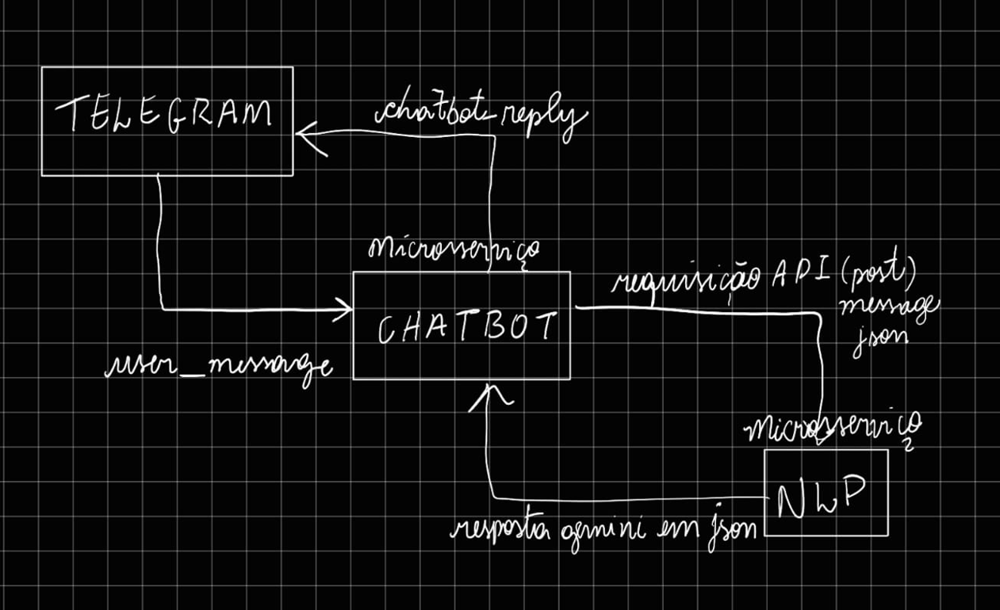

# SISTEMA DE ATENDIMENTO AUTOMATIZADO USANDO CHATBOT

## DESCRIÇÃO
 - ### O projeto consiste em um sistema de chatbot automatizado, desenvolvido com uma arquitetura de microsserviços, que opera em contêineres Docker.

## FERRAMENTAS
 - ### Gemini
 - ### FastAPI 
 - ### Docker
 - ### Chatbot Telegra

## MICROSSERVIÇOS
 - ### Chatbot
 - ### NLP

## Como funciona? 
 